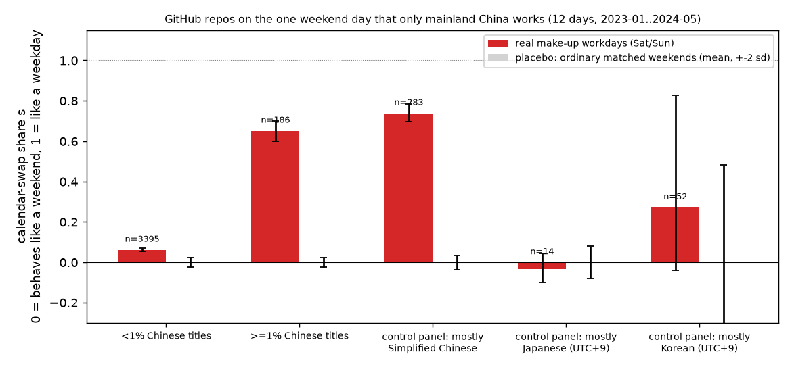
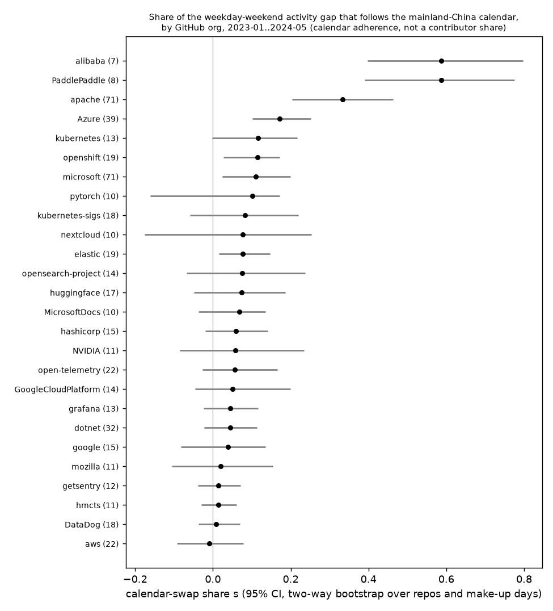

# tiaoxiu-signal: measuring how much open-source work runs on mainland China's calendar, using the weekends only China works

Several times a year, mainland China turns a Saturday or Sunday into an official working day to
pay for a longer holiday. This is 调休 (*tiaoxiu*), and the day is a "make-up workday" (补班). No other
country works on those dates. Time zones and global seasonality treat them like any other
weekend, and most Western holidays do too (exceptions: 2024-02-18 and 2026-02-14 fall on US
Presidents' Day weekends). That makes each one a close-to-clean natural experiment: if a project's
activity on that specific weekend day looks like a weekday, part of that project's activity
follows the mainland-China work calendar. This measures calendar adherence, not nationality or
location.

This repo turns that observation into an estimator. It runs the estimator on public GitHub event
data (GH Archive, via the public ClickHouse playground), validates it with placebos, controls and
out-of-sample holdouts, and red-teams it ([RED_TEAM.md](RED_TEAM.md)). Its **outputs contain no
personal data**. Account logins are used only inside server-side distinct counts and the bot
filter. Issue/PR titles are used only inside a server-side script-detection count. Nothing
leaves the database except per-repository daily counts and per-repository title-script counts.
No profiles, locations, e-mails, names or commit time-zone offsets are used.

Search-engine-friendly summary of the numbers: [GIST.md](GIST.md) (also published as a public gist when permissions allow).



## The estimator ("calendar-swap share", s)

For a repository, take a local window of ±21 days around each make-up day *m*, excluding Chinese
holidays ±2 days, other make-up days, major non-Chinese holidays and days with incomplete data.
In that window:

* W = mean daily **distinct human accounts** active on ordinary weekdays;
* E = the same on ordinary weekend days with the same weekday as *m*;
* A = the count on the make-up day itself.

```
s = Σ_m (A_m − E_m) / Σ_m (W_m − E_m)
```

s is the fraction of the repo's weekday-over-weekend gap that "switches on" when only mainland
China goes to work. A value of 0 means the day behaves like a normal weekend; 1 means it behaves
like a normal weekday. If every group of contributors has a similar weekend/weekday ratio, s is
roughly the share of the repo's weekday activity coming from people on the mainland-China work
calendar. That is an assumption; see [RED_TEAM.md](RED_TEAM.md) rows 15 and 17.

Inference uses **placebos**: the same estimator on hundreds of sets of ordinary weekend days,
matched on weekday. All group, organisation and holdout CIs are a two-way pairs bootstrap over
repositories **and** make-up days. With only 12 days, day-to-day variation dominates; a repo-only
bootstrap understates the uncertainty by about 2×. Per-repo tests use empirical placebo p-values
(500 placebo sets) with Benjamini–Hochberg FDR control.

"Human" here means work events (push, PR, issue, comment, review) by accounts whose login does
not look like a bot.

## Data

* `default.github_events` on the public ClickHouse playground (`https://play.clickhouse.com/?user=play`),
a copy of GH Archive. The playground copy has every hour covered (at least one event per hour)
for **2023-01-13..2024-06-04** and **2025-09-26..2026-07-02** (with a hole on 2025-10-09..14).
Hourly coverage is not completeness: from mid-2025 capture falls sharply and unevenly by event
type and hour (see limits). This gives two eras:
* **E1**: China dates 2023-01-15..2024-06-03, with **12 make-up days**;
* **E2**: 2025-10-16..2026-07-01, with **4 make-up days**.
* Panel: every repo with ≥50 distinct human accounts and ≥5,000 human work events in E1 (4,473
repos; ≥2,500 events in E2, 1,431 repos). The 3,581 E1 repos with a large enough weekday–weekend
gap and ≥30 issue/PR titles are "eligible".
* Calendar: [NateScarlet/holiday-cn](https://github.com/NateScarlet/holiday-cn) (MIT), compiled
from State Council notices, pinned at commit `159faa5`.
* Independent check signal: the share of a repo's opened issue/PR titles that contain Han
characters and no Japanese kana ("Chinese titles"). It is never used by the estimator.
* Context only: GitHub Innovation Graph `developers.csv` (CC0), pinned at commit `078fb62`.

Every SQL statement that was run is in [`data/queries.sql`](data/queries.sql).

## Results (E1 unless stated; all numbers from `results/SUMMARY.md`)

**1. The signal is real and specific to the calendar.**

| group (E1) | repos | s on make-up days | placebo weekends |
|---|---|---|---|
| ≥1% Chinese titles | 186 | **0.652** [0.52, 0.77] | −0.001 ± 0.012 |
| <1% Chinese titles | 3,395 | **0.062** [0.046, 0.082] | +0.001 ± 0.012 |
| control panel: mostly Simplified-Chinese titles | 283 | 0.739 [0.696, 0.785]* | −0.001 ± 0.017 |
| control panel: mostly Japanese titles (UTC+9, no make-up days) | 14 | −0.032 [−0.101, 0.044]* | +0.000 ± 0.041 |

CIs are two-way bootstrap over repos and make-up days. *Control-panel CIs are over repos only.

On ordinary weekends, Chinese-language repos look like everyone else's weekend. On the 12
make-up weekends they run at about two thirds of a normal weekday. The small Japanese-language
control (14 repos, one hour away) does not move.

**2. A smaller signal in repos with few or no Chinese titles.** For the 3,395 repos with <1%
Chinese titles, s = 0.062 [0.046, 0.082], and the uplift is positive on **12 of 12** make-up days
(sign test p = 0.0002). Most of that group's excess comes from the 684 repos that do have *some*
Chinese titles (0 < share < 1%: s = 0.130 [0.097, 0.173]). The 2,711 repos with no Chinese titles
at all score 0.033 [0.021, 0.048] (z≈2.7). Part of that may be holiday proximity rather than the
make-up day itself (see limits). At the repo level, **257** repos are individually significant
(empirical placebo p, BH q < 0.05). 140 of them have <1% Chinese titles and 70 have none. As a
base rate, that is 4% of the <1% group and 63% of the ≥1% group.

The excess on make-up days falls in **Beijing office hours**. For the <1% group, 78% of it lands
between 09:00 and 19:00 CST, against 37% of the same repos' normal weekday–weekend gap. There is
a dip at 12:00, the lunch hour (actor-hours at 11h/12h/13h/14h: 2,366 / 1,222 / 1,426 / 2,530).
The repos with no Chinese titles show the same shape (78% in office hours). This hourly profile
is computed from the same estimator weights at hourly resolution (`results/mechanism.json`).

**3. It predicts later make-up days (out-of-sample).**

* **Split-half** (the main holdout): repos flagged on the 7 make-up days of 2023 (empirical-p BH
q < 0.05 and s > 0.3; 188 repos) score **0.581** [0.47, 0.68] on the 5 make-up days of 2024.
The 93 flagged repos with <1% Chinese titles score **0.449** [0.34, 0.56]. Unflagged repos
score 0.041 [0.030, 0.056].
* **2025–26 (sign only).** Of the repos flagged in 2023–24 that are still in the 2025–26 panel,
the 40 flagged ones are again positive on the 4 make-up days of 2026 (z = 10 against E2
placebos), and so are the 22 with <1% Chinese titles (z = 6). The 524 unflagged repos are not
(z = −0.4). We report only the sign. The 2025–26 data are degraded (see limits), so their
magnitudes are not comparable with E1 and are not quoted.

**4. Organisations (pooled over each org's eligible repos; only orgs with ≥10 eligible repos,
plus two openly China-headquartered companies used as known positives).**



* **Apache Software Foundation** (71 repos): pooled s = **0.33** [0.20, 0.46], although only
**1.3%** of its issue/PR titles are in Chinese. The pooled value is concentrated. The 10 repos
that contribute most to the numerator account for 62% of it. The median repo scores 0.21, and
pooling without the top 5 gives 0.23. Read it as "about a third of the ASF's pooled weekday
activity gap, in its most active repos, follows the mainland calendar". It is not a contributor
share.
* Known positives: Baidu's PaddlePaddle 0.59 [0.39, 0.77] and Alibaba 0.59 [0.40, 0.80].
* Near zero: AWS −0.01, DataDog 0.01, UK HM Courts & Tribunals Service 0.01, getsentry 0.01,
Mozilla 0.02 (all CIs include 0).
* In between: Microsoft's Azure SDK org 0.17 [0.10, 0.25], Microsoft 0.11 [0.02, 0.20], OpenShift
0.11 [0.03, 0.17]. Kubernetes 0.12 [−0.00, 0.22] and PyTorch 0.10 [−0.16, 0.17] have CIs that
include 0.

The full table (E1 only, with two-way CIs, median repo and leave-top-5-out values) is in
`results/orgs_E1_public.csv`. Organisation values for 2025–26 are not published (see limits).

## Why it matters

* **An aggregate, location-free indicator of calendar exposure.** Release planning and dependency
risk analyses benefit from knowing how much of a project's activity pauses on a given holiday
calendar. Existing methods geocode people. This one only needs public aggregate counts and a
calendar, and it says nothing about any individual.
* **Operational planning.** A project with s ≈ 0.5 loses roughly half its weekday activity during
Spring Festival and Golden Week. That is useful for release timing, security-response
expectations and SLAs on dependencies.
* **The trick generalises.** Any jurisdiction-specific shift of working days, including bridge
days and moved holidays in other countries, can be used as an instrument the same way.

## Honest limits (details in [RED_TEAM.md](RED_TEAM.md))

* s measures **adherence to the mainland-China official work calendar**, not nationality or
location. Reading it as a share of contributors assumes similar weekend ratios. Even
mostly-Chinese repos reach only about 0.74, so for those repos s is conservative.
* **Day boundary.** Days are cut at Asia/Shanghai midnight. With UTC days instead, the <1% group
scores 0.048 rather than 0.062 (≥1%: 0.646 vs 0.652). The sign is robust, but the scale for
Western-heavy repos depends on the boundary: a Shanghai Saturday contains US Friday working
hours. This plausibly also contributes to the gap between Saturday-only (0.120) and Sunday-only
(0.054) make-up days.
* **Holiday proximity.** Make-up days always border a Chinese holiday; the placebo weekends
mostly do not. Ordinary same-weekday days 1–3 weeks from each make-up day show 0.012 (z≈1) for
the <1% group. On the five weekends where the other weekend day is an ordinary day, that
**partner day** shows an uplift too. For the same 3,395 repos it is 0.037, against 0.077 on the
make-up day itself. That partner-day uplift is mostly *outside* Beijing office hours (1,147 actor-hours
inside 09–19 CST vs 3,663 outside), so it looks like a weekend-level seasonal or proximity
effect, not mainland office work. Subtracting it leaves 0.040. So **up to about half** of the
<1% group's signal may be proximity rather than the make-up day. The red-team estimated about
a third with a slightly different repo set. For repos with no Chinese titles the correction is
larger (0.041 → 0.012). For ≥1%-Chinese repos it is negligible (0.783 → 0.750).
* **2025–26 (E2) is uninformative: sign only.** It has 4 make-up days and degraded capture (next
bullet). For repos with <1% Chinese titles, the two-way CI is [−0.16, 0.20], so E2 neither
confirms nor refutes the E1 value. We quote no E2 magnitudes (holdout or organisation) and make
no trend claim.
* **GH Archive capture diagnostics** (`results/capture.json`, GitHub-wide human work events).
Weekday events per day in E2 vs E1:
* issue comments −72%, PR reviews −71%, PRs −57%, PR review comments −55%, issues −24%;
* pushes −2%.

Within E2, non-push events fall 86% from February to June 2026 while pushes rise 56%.
The hour-of-week profile flattens (coefficient of variation 0.19 → 0.05; max/min 2.05 → 1.33).
The weekend/weekday ratio rises from 0.77 to 1.01. **Opened-PR titles are empty in 100% of E2
events** (0% in E1), so E2 "Chinese titles" come from issue titles only. Our day filter only
requires every hour to have at least one event, so it cannot detect partial capture. The local
ratio cancels slow multiplicative drift, but not capture that depends on volume, hour or event
type. That kind of capture is expected to inflate E2 values: two of the four E2 days give s > 1
for ≥1%-Chinese repos.
* **Post-hoc choices.** Several choices were made after seeing data, and we say so:
* Carnival and US Presidents' Day were added to the non-Chinese holiday exclusions after a
spurious 2026 holiday dip appeared.
* The Korean control was set aside as "bootcamp-dominated" after seeing its noise.
* One coding-school organisation was left out of the public organisation table.
* Controls: the Japanese control is clean but small (n=14). The Korean control is noisy and
inconclusive (bootcamp repos). A Taiwan/Hong Kong control was not possible (too few repos).
"Chinese titles" (Han characters, no kana) also include Traditional Chinese and
internationalisation PRs that quote Chinese UI strings.
* Per-repo estimates are noisy. Normal-approximation per-repo p-values are anticonservative (289
repos would pass instead of 257). We deliberately publish only group and organisation
aggregates. The method should not be used to screen individual projects or people.
* The sample is the most active public repos only; private and enterprise work is invisible.
Bots are filtered by login name only.
* Source gaps: no data in the playground copy from June 2024 to September 2025. Raw GH Archive
files could add 6 more make-up days, but from mid-2025 they suffer the same capture loss.

## Reproduce

```bash
./run_all.sh          # python3 + internet; no keys, no paid services; tens of minutes on a cold cache
cat results/SUMMARY.md
```

`run_all.sh` downloads the pinned calendar and Innovation Graph inputs. It then sends about 200
SQL queries to the public ClickHouse playground (cached in `data/raw/`, logged in
`data/queries.sql`), runs the analysis, placebos, holdouts and robustness grid, and regenerates
the figures and `results/SUMMARY.md`. Placebo draws use fixed seeds. Per-repo intermediate files
are written locally but intentionally not committed.

Layout: `src/ch.py` (query client), `src/extract*.py` (data pull), `src/core.py` (estimator),
`src/placebo.py`, `src/analyze.py`, `src/robustness.py`, `src/extra_checks.py`,
`src/mechanism.py` (hour-of-day and UTC-boundary checks), `src/capture_diagnostics.py`,
`src/publish_tables.py`, `src/figures.py`, `src/summarize.py`.

## License

MIT (code). Inputs remain under their own terms: GH Archive (public GitHub events), holiday-cn
(MIT), GitHub Innovation Graph (CC0-1.0).
